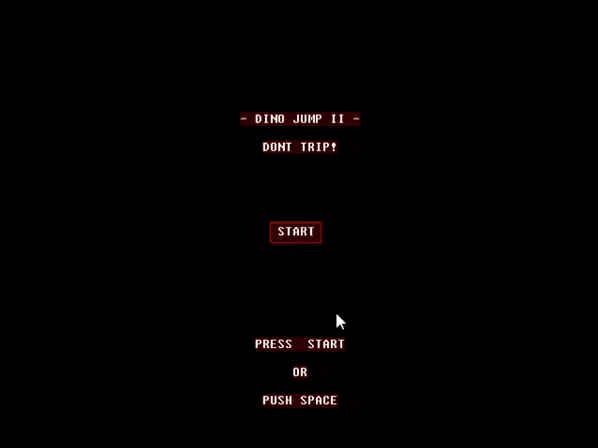
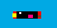
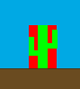
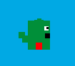
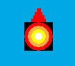

# :space_invader: DINO II :space_invader:
Final practice of the Computer Structure II course. The game is based on Google's dinosaur game.

### Gameplay :clapper:

*Click on the gif to see the video*

### Contacts between objects :collision:

- Bird

- Cactus

- Dinosaur

- Meteor

